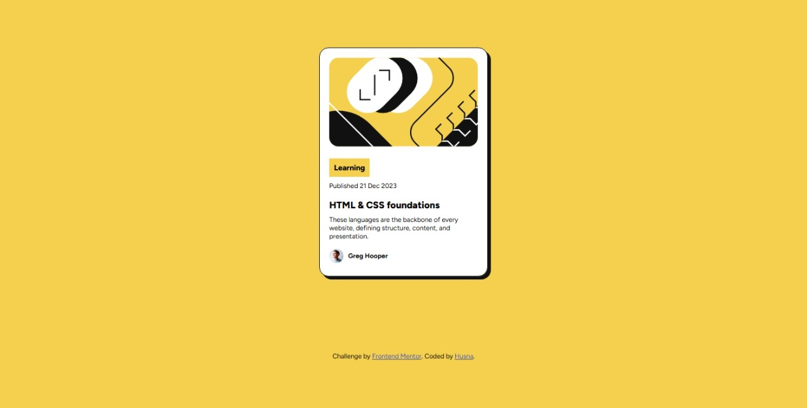

# Frontend Mentor - Blog preview card solution

This is a solution to the [Blog preview card challenge on Frontend Mentor](https://www.frontendmentor.io/challenges/blog-preview-card-ckPaj01IcS). Frontend Mentor challenges help you improve your coding skills by building realistic projects. 

## Table of contents

- [Overview](#overview)
  - [The challenge](#the-challenge)
  - [Screenshot](#screenshot)
  - [Links](#links)
- [My process](#my-process)
  - [Built with](#built-with)
  - [What I learned](#what-i-learned)
  - [Continued development](#continued-development)
  - [Useful resources](#useful-resources)
- [Author](#author)
- [Acknowledgments](#acknowledgments)

## Overview

### The challenge

Users should be able to:

- See hover and focus states for all interactive elements on the page

### Screenshot



### Links

- Solution URL: [Add solution URL here](https://your-solution-url.com)
- Live Site URL: [https://hushus23.github.io/hushus23.github.io-fmchallenge-blogpreviewcard/]

## My process

### Built with

- Semantic HTML5 markup
- CSS custom properties

**Note: These are just examples. Delete this note and replace the list above with your own choices**

### What I learned

Use this section to recap over some of your major learnings while working through this project. Writing these out and providing code samples of areas you want to highlight is a great way to reinforce your own knowledge.

To see how you can add code snippets, see below:

```html
<body>
<div class="card">
  <div class="image">
    
  </div>
  <div class="box">
     Learning
  </div>
  <div class="date">
     Published 21 Dec 2023
  </div>
  <div class="title">
      HTML & CSS foundations
  </div>
  <div class="description">
    These languages are the backbone of every website, defining structure, content, and presentation.
  </div>
  <div class="author">
    
    <p>Greg Hooper</p>
  </div>
</div>
<div class="attribution">
  Challenge by <a href="https://www.frontendmentor.io?ref=challenge" target="_blank">Frontend Mentor</a>. 
  Coded by <a href="#">Husna</a>.
</div>
</body>
```
```css
 <style>
    @import url('https://fonts.googleapis.com/css2?family=Figtree:ital,wght@0,300..900;1,300..900&display=swap');

    body{
      margin: auto;
      background-color: hsl(47, 88%, 63%);
      padding: 0%;
      font-family: "Figtree", sans-serif;
    }
    .card{
      margin-left: auto;
      margin-right: auto;
      margin-top: 5rem;
      align-self: center;
      max-width:250px;
      border-radius: 1rem;
      padding:1rem;
      background-color: hsl(0, 0%, 100%);
      border: 1px solid hsl(0, 0%, 7%);
      box-shadow: 5px 5px hsl(0, 0%, 7%);
    }
    .image{
      margin-bottom: 1rem;
      max-width: fit-content;
    }
    .image img{
      max-width: 250px;
      border-radius: 1rem;
    }
    .box{
      background-color:hsl(47, 88%, 63%) ;
      width: fit-content;
      padding: 0.5rem;
      font-weight: 800;
      font-size: 0.8rem;
      margin-bottom: 0.5rem;
    }
    .date{
      font-size: 0.7rem;
      margin-bottom: 1rem;
      font-weight: 400;
    }
    .title{
      font-size: 1rem;
      font-weight: 800;
      /* color: hsl(47, 88%, 63%); */
    }
    .title:hover{
      color: hsl(47, 88%, 63%);
    }
    .description{
      margin-top: 0.5rem;
      font-size: 0.7rem;
    }
    .author{
      margin-top: 0.5rem;
      display:flex;
      flex-wrap: nowrap;
      align-items: center;
      gap: 0.5rem;
    }
    .author img{
      max-width: 24px;
      max-height: 24px;
    }
    .author p{
      font-size: 0.7rem;
      font-weight: 700;
    }
    .attribution { 
      margin-top: 8rem;
      font-size: 11px; 
      text-align: center; 
    }
    .attribution a { 
      color: hsl(228, 45%, 44%); 
    }
  </style>
```


### Continued development

Use this section to outline areas that you want to continue focusing on in future projects. These could be concepts you're still not completely comfortable with or techniques you found useful that you want to refine and perfect.

### Useful resources

- [https://css-tricks.com/snippets/css/a-guide-to-flexbox/] - This helped me for about flexbox


## Author

- Frontend Mentor - [@hushus23]
## Acknowledgments

This is where you can give a hat tip to anyone who helped you out on this project. Perhaps you worked in a team or got some inspiration from someone else's solution. This is the perfect place to give them some credit.

